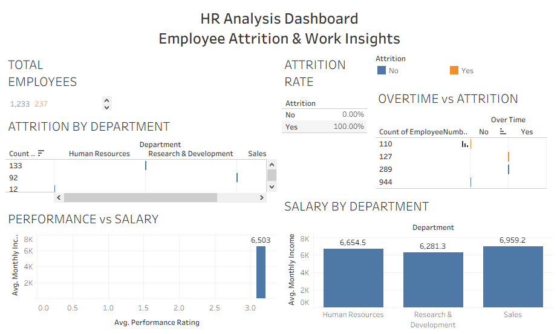

# 👥 HR Analytics Dashboard: Employee Attrition & Performance Analysis

## 🎯 Business Problem

The HR department wants to understand why employees leave and how salary and performance affect retention.

## 🛠️ Tools Used

- SQL (Data Analysis)
-  Google Sheets
- Tableau 
- Data Visualization

## 📂 Dataset

- HR employee dataset from Kaggle
- Includes:
  - Employee ID
  - Department
  - Salary
  - Attrition
  - Performance Rating

## 🧹 Data Preparation

- Cleaned missing values
- Standardized salary fields
- Created attrition categories
- Grouped salary bands
‘’’sql
SELECT attrition, COUNT(*) 
FROM employees
GROUP BY attrition;
‘’’
## 🔍 Key Insights

- Employees with lower salary leave more
- Certain departments have higher attrition
- Performance is linked to salary

## 📈 Business Impact

- Helps reduce employee turnover
- Improves salary structure decisions
- Supports HR decision-making

## 📌 Recommendations

- Improve salary in high-attrition departments
- Introduce retention programs
- Offer performance incentives

## 📊 Dashboard

## 👤 Author

**Ahmed Basheer**  
Aspiring Data Analyst  

📊 Skills:  
SQL | Google Sheets | Data Visualization | Data Analysis | Tableau |

📫 Contact:  
Email: ab11999333@gmail.com  
LinkedIn: http://linkedin.com/in/ahmed-basheer93
GitHub Portfolio: https://ab1993-analyst.github.io/#portfolio
 
